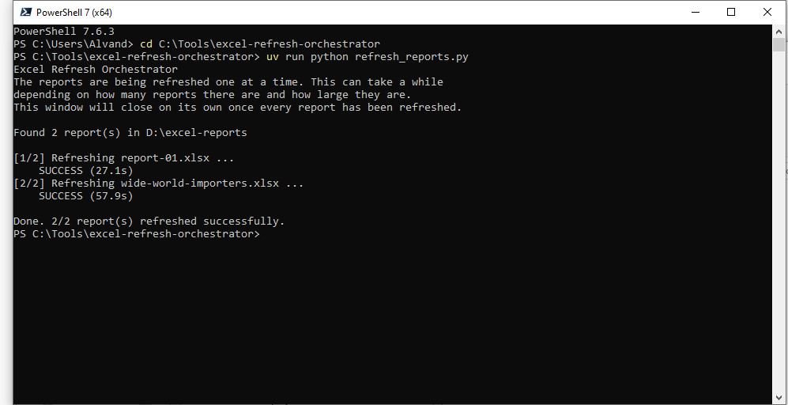
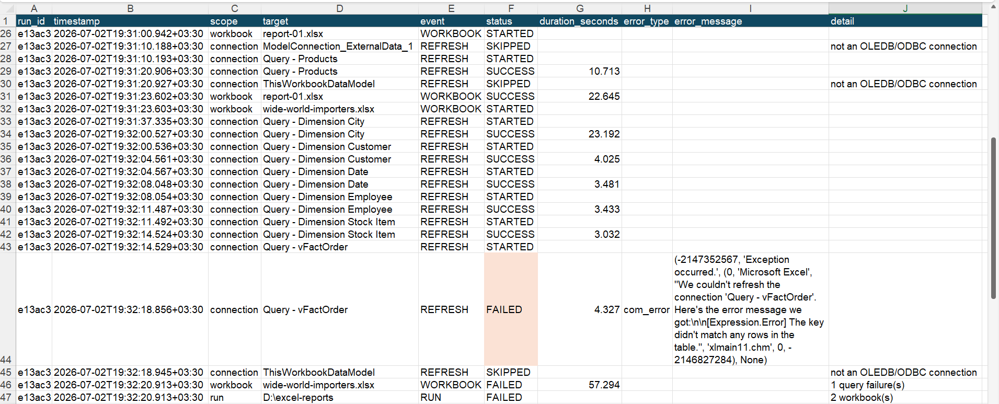

# Excel refresh orchestrator using xlwings module

Automatically refresh a whole folder of Excel reports containing Power Query queries on a schedule, catching and reporting any query that fails, with a log you can build reports on and an optional Outlook summary email.

---

Under the hood this runs on [xlwings](https://www.xlwings.org/) ([docs](https://docs.xlwings.org/en/latest/)), the open source Python package that drives Excel over COM. It's BSD 3-Clause licensed, I'm using it as a normal dependency here with `uv sync`, not redistributing any of its code, so nothing about the license needs special handling for what this project does with it.

## The problem this program solves

Power Query doesn't refresh itself. To update a report we have to open the workbook, click **Data → Refresh All**, wait, and save. With one report that's a minor chore. With ten or a hundred it's a real time sink and a repetitive, it's easy to forget, and it never happens overnight when you'd want it to.

This tool does that for you. You point it at a folder and it opens each workbook, refreshes its queries, saves, and moves on, unattended, on whatever schedule you set. 
It refreshes each query individually so that when one fails (a renamed source column, a missing view, a database error) it tells you **which** query failed and **why**, instead of silently reporting success on stale data. 
Drop a new workbook into the folder and it's included on the next run, there's nothing to set up per file.

> **Windows only.** It drives the real Excel desktop application, so it needs Excel installed and a logged-in, awake session at the scheduled time. 
> The optional email uses your Outlook desktop app that you have also logged into.

---

## How it works

- **One program, one folder.** `refresh_reports.py` scans your reports folder and refreshes each workbook it finds. You schedule this one program, not a scheduled task
  per report.
- **One fresh Excel per workbook.** Each file opens in its own Excel instance, so a hang or crash on one report can't take down the rest of the batch. A **watchdog** force closes Excel if a single workbook runs past your time limit, and the run continues.
- **Each query is refreshed and checked individually.** Every connection is refreshed on its own, inside error handling, so a failure is caught and attributed to the specific query. This is deliberate and important: Excel's **Refresh All**, when run from code, does *not* raise or report an error when a query fails, a broken query passes silently.
  This tool does not use it, precisely so the failures are visible.
- **If any query in a workbook fails, that workbook is not saved.** It keeps its last good version, so a report is never left half-updated (some tables fresh, one stale). The failure is logged and can be even emailed for you to fix.
- **It logs everything and can email you.** Results go to a tabular CSV you can report on over time, a readable text log, and an optional Outlook summary.

### The four files

The whole tool is four small Python files, so you can read and understand each:

- **`config.py`** — reads and validates your settings from `config.toml`.
- **`eventlog.py`** — writes the tabular event log (CSV) and the text log.
- **`excel_engine.py`** — finds the workbooks and does the Excel work (open, refresh each query, save) with the watchdog.
- **`refresh_reports.py`** — the program you run: it loops the workbooks, logs each result, prints progress to the console, sends the Outlook summary, and sets the success/failure exit code.

---

## Setup, step by step

### Step 1 — Create the folders

Create the folders first. For example, on your **D:** drive create:

- `D:\excel-reports` - put the workbooks you want refreshed in here.
- `D:\excel-refresh-logs` - The logs are written here automatically.

You can name them anything and put them anywhere. You'll enter whatever you chose in Step 5.

### Step 2 — Put the project on your PC

Unzip the project into a permanent location, for example `C:\Tools\excel-refresh-orchestrator`.

### Step 3 — Install

Open the project folder in File Explorer, click the **address bar** to get the path of the project folder and copy it, then open PowerShell and make the copied address your current working directory using this command:
```powershell
cd C:\Tools\excel-refresh-orchestrator
```

Then you need to run the setup script:

```powershell
powershell -ExecutionPolicy Bypass -File setup.ps1
```

This installs **uv** (a small, fast Python tool) if you don't have it, it then creates a private environment inside the project and installs the one library it uses.

**About Python:** setup uses a Python you already have (**3.14 or newer**) if you have one, and only downloads a self-contained, isolated copy if you don't.

### Step 4 — Prepare Excel once

In order for the refresh to run unattended without a prompt stopping it, you need to do the following in Excel:

1. **Trusted Locations → Add new location** 
    First head to **File → Options → Trust Center → Trust Center Settings** and add your reports folder (tick "Subfolders" if you use them). This stops Excel blocking the files when they open with nobody watching.
2. **Only if your reports connect to databases, SharePoint, Azure, Fabric, etc.:** 
    Open each such report once and sign in when prompted. Windows remembers those logins so later unattended runs reuse them, which is why this tool never asks for source passwords.

### Step 5 — Edit your settings

Open **`config.toml`** in Notepad and set the two paths to the folders from Step 1 if you have created folders with different names:

```toml
[paths]
reports_dir = 'D:\excel-reports'
log_dir     = 'D:\excel-refresh-logs'
```

Keep the single quotes. The rest has sensible defaults, the file is commented, so give it a read. (Turning on email is covered below.)

### Step 6 — Test it manually

Before scheduling anything, run it once and check the result. Either **double-click `run-refresh.cmd`**, or in a new PowerShell window run:

```powershell
uv run python refresh_reports.py
```

This is what you are going to see:



When it finishes, open your log folder. `refresh-events.csv` has a row per event and `excel_refresh.log` is the readable version. Confirm the right workbooks refreshed and that any failures make sense. The exit code is `0` if everything succeeded and `1` if anything failed.

### Step 7 — Schedule it

Open **Task Scheduler** (press Start, type *Task Scheduler*) and choose **Create Task** (not "Basic Task"):

1. **General tab:** name it, and select **"Run only when the user is logged on."** This is essential, Excel automation needs a real desktop. (The other option, "run whether logged on or not", runs with no desktop and Excel will fail.)
2. **Triggers tab → New:** choose Daily (or Weekly) and a start time.
3. **Actions tab → New:** Action = *Start a program*. Program/script = the full path to **`run-refresh.cmd`** in the project folder.


### **The PC must be on and logged in at that scheduled time**

---

## Turning on the email summary

Email is off by default and uses the **Outlook desktop app you're already signed in to**,
no password. In `config.toml`:

```toml
[email]
enabled = true
recipients = ["you@company.com", "teammate@company.com"]
send_on = "always"        # or "failure" to email only when something fails
```

The summary shows how many workbooks succeeded or failed and, for each failure, the workbook, the specific failing query, and the error. Sending mail never changes the run's result, if Outlook can't send, that's logged and the run still reports its real status.

---

## The logs and building reports on them

Two files are written to the log folder:

- **`refresh-events.csv`** — a tidy, append-only table, one row per event, ideal for a  Power BI or Excel report over time.
- **`excel_refresh.log`** — a rotating, human-readable log for debugging a run.

The CSV columns:

| Column | Meaning |
| --- | --- |
| `run_id` | Identifier shared by all rows from one run. |
| `timestamp` | When the event happened (local time, millisecond precision, with offset). |
| `scope` | `run`, `workbook`, or `connection` (a single query). |
| `target` | The reports folder, the workbook file name, or the query/connection name. |
| `event` | `RUN`, `WORKBOOK`, or `REFRESH` (a query refresh). |
| `status` | `STARTED`, `SUCCESS`, `FAILED`, or `SKIPPED`. |
| `duration_seconds` | How long that query / workbook / run took. |
| `error_type` / `error_message` | The error, when something failed (e.g. the source message naming the missing column or view). |
| `detail` | A short note (e.g. why a query was skipped, or the failure count on a workbook). |

Because there's a row per query, we can chart success rate over time, find the slowest queries and workbooks, and see the failure history of any single query.

---

## What does a failed run look like?

Here's an actual run against two reports, `report-01.xlsx` and `wide-world-importers.xlsx`.
I'd renamed a view that the second workbook depends on, in SSMS, on purpose, to see whether the failure got caught and attributed to the right query.



`report-01.xlsx` refreshed cleanly. `wide-world-importers.xlsx` refreshed five queries fine, then `Query - vFactOrder` failed with the real error straight from the source, `[Expression.Error] The key didn't match any rows in the table`, because the view it points to no longer existed under that name. The workbook was left unsaved, exactly as designed.

You'll also notice two rows with a status of `SKIPPED` in the picture, `ModelConnection_ExternalData_1` and `ThisWorkbookDataModel`. That's expected, not a failure. See [Why do some connections show as SKIPPED?](#why-do-some-connections-show-as-skipped)
below.

---

### Why do some connections show as SKIPPED?

When we look at the `refresh-events.csv` file, we will see some rows with `SKIPPED` status. It means *this connection was never meant to be refreshed directly*, not *this data is stale*. It's expected behavior, not a flaw.

The reason is that every workbook connection exposes a `Type` property from Excel's `XlConnectionType` enum.

`_background_off()` in `excel_engine.py` only treats a connection as refreshable if its type is `xlConnectionTypeOLEDB` (1) or `xlConnectionTypeODBC` (2), the two types that actually pull rows from an external source and can fail with a source-level error.

`ThisWorkbookDataModel` and any `ModelConnection_ExternalData_N` connection are type `xlConnectionTypeMODEL` (7). They're internal links into the workbook's own Data Model, not a data source, so neither bucket applies, and the code correctly leaves them alone.

---
